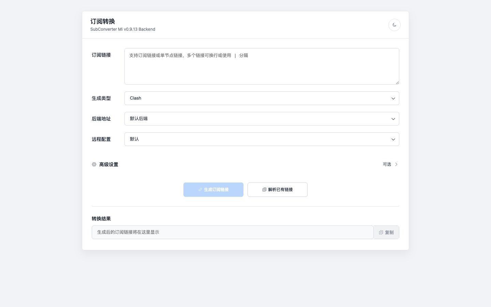
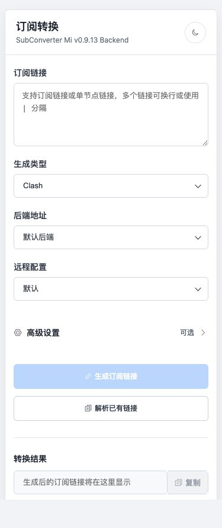

# sub-web-modify

基于 Vue 2 和 Element UI 的订阅转换前端。

## 页面预览

### 桌面端



### 移动端



## 技术栈

- Vue 2.7 + Vue Router 3
- Vue CLI 5 + Webpack
- Element UI 2
- Axios
- Yarn Classic（仓库包含 `yarn.lock`）

## 本地开发

推荐使用 Node.js 22。

```bash
git clone https://github.com/Autlin/sub-web-modify.git
cd sub-web-modify
yarn install --frozen-lockfile
yarn serve
```

开发服务器默认地址为 `http://localhost:8080`。

## 构建

```bash
yarn build
```

构建产物位于 `dist/`，可部署到任意静态 Web 服务器。

## Docker

```bash
docker build -t sub-web-modify .
docker run -d --restart always -p 8090:80 --name sub-web-modify sub-web-modify
```

访问 `http://localhost:8090`。

## 自定义后端

可通过页面的“后端地址”输入框或 URL 参数覆盖默认后端：

```text
http://localhost:8080/?backend=https://xxx.xxx
```
